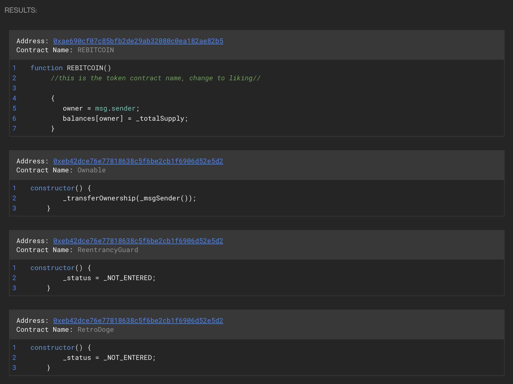

# Value.parent\_value

Returns the parent [Value](./) in case the current one is inside another Value; returns None otherwise.

`property parent_value:` [`Value`](./) `| None`

**Query Example**

```python
from glider import *

def query():
    instructions = Instructions().exec(1,1)
    value = instructions.get_components()

    print(f"Value: {value[0].expression}")
    print(f"Parent values: {value[0].parent_value.expression}")
    
    return instructions
```

**Output**

<figure><figcaption></figcaption></figure>
