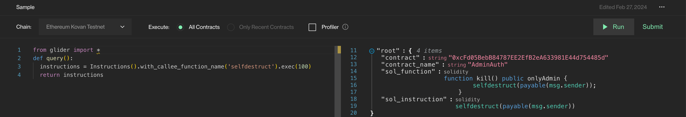

# 🔧 Usage


Note that in case the query is run against a whole blockchain the results will be grouped by uniques bytecodes, thus while checking a contract address, one should also check for similar contracts in etherscan to get full list of duplicate addresses.


### Basic usage

<figure><figcaption>
Sample Query Code
</figcaption></figure>

In general, Glider provides with a REPL-like interface. On the left side, the query code is written; on the right side, the output is shown.&#x20;

* To run the query, the researcher needs to press the `Run` button.
* The `Chain` dropdown list is used to select the blockchain on which to run the query.
* The `Execute` clause is used to filter the recent contracts or to run on a full list. This feature is still in development.
* The `Profiler` checkbox is used to show line-by-line profiling information of the execution; this is useful to do benchmarks, reveal bottlenecks and optimize the query code.
